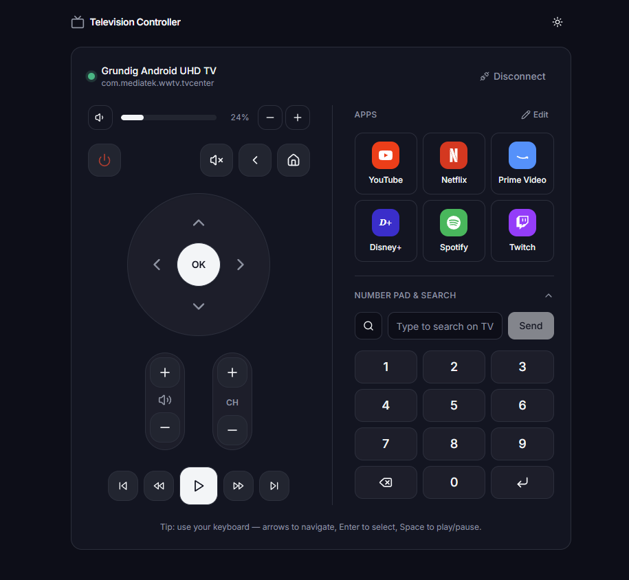

# Television Controller

Verwandle deinen Computer in eine Fernbedienung für deinen Fernseher. Television Controller führt eine kleine App in deinem Browser aus. Diese erkennt deinen Android TV im selben Netzwerk und lässt dich das Gerät steuern – Navigation, Lautstärke, Wiedergabe, Apps und mehr – ganz ohne die echte Fernbedienung in die Hand zu nehmen oder etwas auf dem Fernseher installieren zu müssen.

## Übersicht

Fernbedienung verloren? Genervt vom ständigen Gerätewechsel? Mit Television Controller holst du dir eine vollständige Fernbedienung direkt auf den Bildschirm deines Browsers. Alles läuft lokal in deinem eigenen Netzwerk ab – kein Cloud-Konto, keine Pairing-App auf dem Smartphone und keine zusätzliche Installation auf dem Fernseher selbst.Die App nutzt das offizielle Android TV Remote-Protokoll von Google – genau wie die Google Home-App. Du brauchst also weder den Entwicklermodus noch ADB oder irgendwelche Kabel.

## Features

- **Automatic discovery** of Android TVs on your network, or connect by IP
- **Secure pairing** with a 6-digit code shown on the TV — paired once, then remembered
- **Smart reconnect** that restores the connection automatically after a drop, with no re-pairing
- **Full remote**: D-pad, OK, power, volume, mute, channels, media playback, home and back
- **App shortcuts** with real logos — launch YouTube, Netflix, Prime Video, Disney+, Spotify and more; add, remove and reorder your own
- **Number pad and search** to enter channels or type straight into the TV's search box
- **Live status** — the volume bar and the currently open app update in real time
- **Keyboard control** — arrows to navigate, Enter to select, Space to play/pause, and more
- **Press and hold** to repeat volume, seeking and navigation
- **Clean, responsive interface** that fits on one screen, with light and dark themes

## How it works

1. **Start it.** Run the launcher. It boots a small local server and opens the interface in your browser at `http://localhost:3000`.
2. **It finds your TV.** The app scans your local network and lists the Android TVs it discovers. You can also type the TV's IP address directly.
3. **Pair once.** Pick your TV and a 6-digit code appears on the screen. Enter it in the browser. The pairing is remembered, so you only do this the first time.
4. **Control it.** Use the on-screen remote — every press travels straight to your TV over your local network, instantly.

## Getting started

You only need [Node.js](https://nodejs.org/) 18 or newer installed.

**Windows** — double-click `start.bat`

**macOS / Linux** — run `./start.sh`

The first launch installs what it needs and builds the interface, then opens it in your browser automatically. Later launches start in seconds.

## Keyboard shortcuts

When connected, your keyboard doubles as the remote:

| Key | Action |
| --- | --- |
| Arrow keys | Navigate (D-pad) |
| Enter | Select / OK |
| Backspace / Esc | Back |
| Space | Play / pause |
| `+` / `-` | Volume up / down |
| `M` | Mute |
| `H` | Home |
| `P` | Power |

## Requirements

- A computer and an Android TV / Google TV on the **same local network**
- [Node.js](https://nodejs.org/) 18 or newer

## Supported TVs

Any Android TV or Google TV based television or device, including Grundig, Sony, Philips, TCL, Nvidia Shield and Chromecast with Google TV.

Very old Grundig models that are not Android-based (Linux/Zeasn) are not supported, since they don't speak the same remote protocol.

## Privacy

Nothing leaves your network. The connection is made directly to the TV, and the pairing certificate is stored locally on your machine and never shared.

## License

MIT
